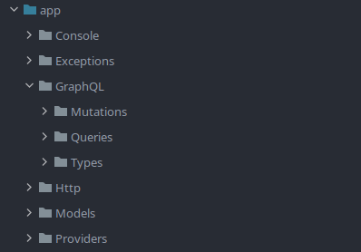
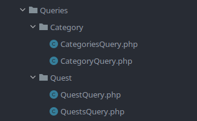
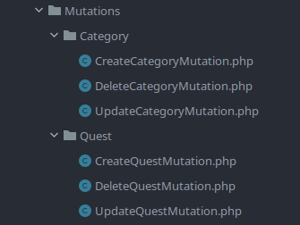

# Laravel + GraphQL

Exemplo muito simples e básico de como implementar GraphQL em um projeto Laravel.

## Dependências

`composer require rebing/graphql-laravel`

## Publicando o arquivo de configuração

Depois de instalar a dependência, você deve publicar o arquivo de configuração:

`php artisan vendor:publish --provider="Rebing\\GraphQL\\GraphQLServiceProvider"`

## Criando as bases

Crie migrations, models, factories e seeders normalmente.

## Implementando o GraphQL

Agora sim vamos implementar o GraphQL. 

### Estrutura de pastas

Crie uma pasta chamada `GraphQL` dentro da pasta `app`.

Dentro da pasta `GraphQL`, crie uma pasta chamada `Types`, outra chamada `Queries` e outra chamada `Mutations`.

Vai ficar algo assim:



Explicando:

- `Types`: Aqui ficarão os tipos de dados que você quer retornar, pense algo como um modelo.
- `Queries`: Aqui ficarão as buscas que você quer fazer, sejam elas simples ou complexas.
- `Mutations`: Aqui ficarão as alterações que você quer fazer, como inserir, atualizar ou deletar.

Claro que você pode criar mais pastas e organizar da forma que achar melhor.
O importante é que o arquivo de configuração do GraphQL saiba onde encontrar esses arquivos.

### Types

Dentro da pasta `Types`, crie um arquivo com o nome seguindo o padrão `NomeDaClasseType.php`.

Segue um exemplo:

```php
<?php

namespace App\GraphQL\Types;

use App\Models\Category;
use GraphQL\Type\Definition\Type;
use Rebing\GraphQL\Support\Type as GraphQLType;
use Rebing\GraphQL\Support\Facades\GraphQL;

class CategoryType extends GraphQLType
{
    protected $attributes = [
        'name' => 'Category',
        'description' => 'Collection of categories',
        'model' => Category::class
    ];

    public function fields(): array
    {
        return [
            'id' => [
                'type' => Type::nonNull(Type::int()),
                'description' => 'The id of the category'
            ],
            'title' => [
                'type' => Type::nonNull(Type::string()),
                'description' => 'The title of the category'
            ],
            'quests' => [
                'type' => Type::listOf(GraphQL::type('Quest')),
                'description' => 'The quests of the category'
            ]
        ];
    }
}
```
Perceba o uso do `Category::class` no atributo `model`. Isso é importante para que o GraphQL saiba de onde pegar os dados.

#### Estrutura do arquivo Type

- Extende a classe `GraphQLType` do pacote `rebing/graphql-laravel`.
- Atributo `attributes`: Aqui você define o nome da classe, a descrição e a Model que será usada.
- Método `fields`: Aqui você define os campos que serão retornados e o tipo de cada um.

### Queries

Dentro da pasta `Queries`, crie uma pasta com o nome da entidade que você quer buscar.

Dentro dessa pasta, crie um arquivo com o nome singular da entidade seguido de `Query.php` (ex: `CategoryQuery.php`) e outro com o nome plural seguido de `Query.php` (ex: `CategoriesQuery.php`).

As pastas e arquivos ficarão assim:



Segue um exemplo de `CategoryQuery.php`:

```php
<?php

namespace App\GraphQL\Queries\Category;

use App\Models\Category;
use GraphQL\Type\Definition\Type;
use Rebing\GraphQL\Support\Facades\GraphQL;
use Rebing\GraphQL\Support\Query;

class CategoryQuery extends Query
{
    protected $attributes = [
        'name' => 'category',
    ];

    public function type(): Type
    {
        return GraphQL::type('Category');
    }

    public function args(): array
    {
        return [
            'id' => [
                'name' => 'id',
                'type' => Type::int(),
                'rules' => ['required']
            ]
        ];
    }

    public function resolve($root, $args): Category
    {
        return Category::findOrFail($args['id']);
    }
}
```

Segue um exemplo de `CategoriesQuery.php`:

```php
<?php

namespace App\GraphQL\Queries\Category;

use App\Models\Category;
use GraphQL\Type\Definition\Type;
use Illuminate\Database\Eloquent\Collection;
use Rebing\GraphQL\Support\Facades\GraphQL;
use Rebing\GraphQL\Support\Query;

class CategoriesQuery extends Query
{
    protected $attributes = [
        'name' => 'categories',
    ];

    public function type(): Type
    {
        return Type::listOf(GraphQL::type('Category'));
    }

    public function resolve($root, $args): Collection
    {
        return Category::all();
    }
}
```

#### Estrutura do arquivo Query

- `CategoryQuery.php`: Aqui você busca uma categoria específica, passando o `id` como argumento.
- `CategoriesQuery.php`: Aqui você busca todas as categorias.
- Atributo `attributes`: Aqui você define o nome da query.
- Método `type`: Aqui você define o tipo de retorno. Lembre-se de usar o método `GraphQL::type('NomeDaClasse')`. Esse método pega o tipo que você definiu no arquivo `Type`.
- Método `args`: Aqui você define os argumentos que a query vai receber. Só está sendo usado o `id` como exemplo e somente na `CategoryQuery`.
- Método `resolve`: Aqui você define o que a query vai fazer. No caso, está retornando uma categoria específica ou todas as categorias.

O método `resolve` é basicamente retornar os dados com Eloquent.

### Mutations

Dentro da pasta `Mutations`, crie uma pasta com o nome da entidade que você quer alterar.

Dentro dessa pasta, crie os seguintes arquivos:

- `CreateNomeDaClasseMutation.php`
- `UpdateNomeDaClasseMutation.php`
- `DeleteNomeDaClasseMutation.php`

As pastas e arquivos ficarão assim:



Segue um exemplo de `CreateCategoryMutation.php`:

```php
<?php

namespace App\GraphQL\Mutations\Category;

use App\Models\Category;
use Rebing\GraphQL\Support\Mutation;
use GraphQL\Type\Definition\Type;
use Rebing\GraphQL\Support\Facades\GraphQL;

class CreateCategoryMutation extends Mutation
{
    protected $attributes = [
        'name' => 'createCategory',
        'description' => 'Creates a category'
    ];

    public function type(): Type
    {
        return GraphQL::type('Category');
    }

    public function args(): array
    {
        return [
            'title' => [
                'name' => 'title',
                'type' =>  Type::nonNull(Type::string()),
            ],
        ];
    }

    public function resolve($root, $args): Category
    {
        $category = new Category();
        $category->fill($args);
        $category->save();

        return $category;
    }
}
```

Nos arquivos `UpdateNomeDaClasseMutation.php` e `DeleteNomeDaClasseMutation.php`, o processo é o mesmo, mudando apenas o nome da classe e o método `resolve`.

Dentro do método `resolve`, você faz a alteração ou exclusão dos dados.

Pode ser que você queira fazer validações antes de salvar, então você pode usar o método `rules` no método `args`.

### Configurando o GraphQL

Dentro do arquivo `config/graphql.php`, você deve adicionar os arquivos que você criou como `schemas`.

```php
'schemas' => [
        'default' => [
            'query' => [
                'quest' => App\GraphQL\Queries\Quest\QuestQuery::class,
                'quests' => App\GraphQL\Queries\Quest\QuestsQuery::class,
                'category' => App\GraphQL\Queries\Category\CategoryQuery::class,
                'categories' => App\GraphQL\Queries\Category\CategoriesQuery::class,
            ],
            'mutation' => [
                 'createQuest' => App\GraphQL\Mutations\Quest\CreateQuestMutation::class,
                'updateQuest' => App\GraphQL\Mutations\Quest\UpdateQuestMutation::class,
                'deleteQuest' => App\GraphQL\Mutations\Quest\DeleteQuestMutation::class,
                'createCategory' => App\GraphQL\Mutations\Category\CreateCategoryMutation::class,
                'updateCategory' => App\GraphQL\Mutations\Category\UpdateCategoryMutation::class,
                'deleteCategory' => App\GraphQL\Mutations\Category\DeleteCategoryMutation::class,
            ],
            'middleware' => [],
            'method' => ['get', 'post'],
        ],
    ],

 'types' => [
        // ExampleType::class,
        // ExampleRelationType::class,
        // \Rebing\GraphQL\Support\UploadType::class,
        'Category' => App\GraphQL\Types\CategoryType::class,
        'Quest' => App\GraphQL\Types\QuestType::class,
    ],
```

Nesse momento, você deve colocar os arquivos que você criou no lugar dos exemplos que estão no arquivo.

### Rotas

Dentro do arquivo de configuração do GraphQL, você pode definir o prefixo das rotas.

### Testando

Dentro do Postman, você pode fazer as requisições para testar.

#### Query

#### Exemplo Busca com ID específico

```
{
    category(id: 1) {
        id
        title
    }
}
```

#### Exemplo Busca de todos

```
{
    categories {
        id
        title
    }
}
```

#### Mutation

#### Exemplo de criação

```
mutation {
    createCategory(
        title: "Nova Categoria"
    ) {
        id
        title
    }
}
```

#### Exemplo de atualização

```
mutation {
    updateCategory(
        id: 1,
        title: "Categoria Atualizada"
    ) {
        id
        title
    }
}
```

#### Exemplo de exclusão

```
mutation {
    deleteCategory(id: 12)
}
```
